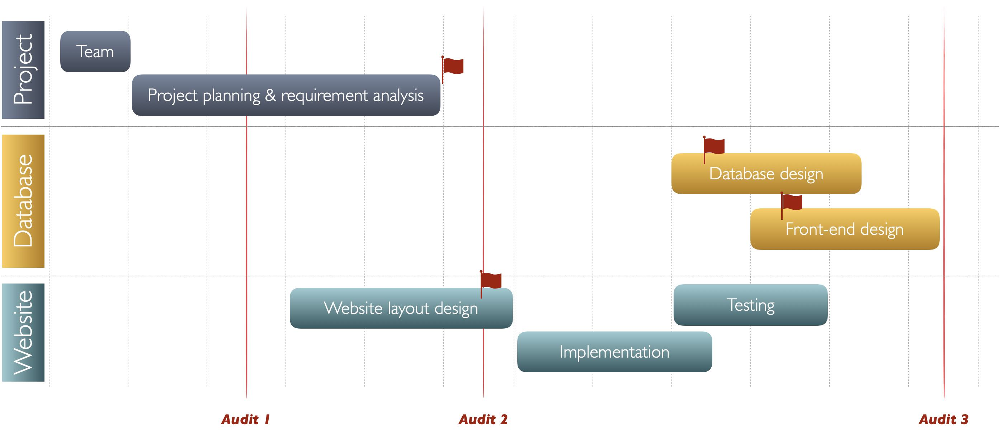

# Landing Page - TechLauncher2021 & ANFF OptoFab

> Our ambition is to streamline the process for online orders and offline communications supported by the integration of a robust database design and user-friendly web-flow experience for our client.



## Project Overview

| Local Database                                                                         | [Web Application](http://tl20212.cecs.anu.edu.au/home.html)                    |
| -------------------------------------------------------------------------------------- | ------------------------------------------------------------------------------ |
| Store client order specifications, metrology and operational information               | Lodge client orders over the internet and assign anonymous identification      |
| Import orders and RFQ’s submitted on the ANFF Optofab website                          | Allow staff to update the operational status of ANFF facilities                |
| Track costs and usages of materials and services                                       | Show live order status by order number on the web page on demand               |
| Supporting documentation e.g: Materials Transfer Agreements, Billing Information, etc. | A means for clients to attach documents and specifications as part of an order |

### Project Requirement

- Lodge client orders over the internet and assign anonymous identification
- Allow staff to update the operational status of ANFF facilities
- Show live order status by order number on the web page on demand
- A means for clients to attach documents and specifications as part of an order
- Must be easily maintained and modified by untrained non-IT staff
- Must be intuitive for both clients and users
- Must be flexible enough to be modified and reused for future capabilities Must comply with ANU IT security requirements
- ANU IT/Physics SCU must be consulted on design and implementation

## Client

| Name     | **ANFF OptoFab ACT**                                                                                                                                                                                         |
| -------- | ------------------------------------------------------------------------------------------------------------------------------------------------------------------------------------------------------------ |
| Website  | http://optofab-act.org.au                                                                                                                                                                                    |
| Contacts | Dr Johannes Eichholz: <johannes.eichholz@anu.edu.au> Mr Deon Hickey: <Deon.Hickey@anu.edu.au> A/Prof. Steve Madden: <stephen.madden@anu.edu.au> Mr Sukanta Debbarma : <debbarma.sukanta@anu.edu.au> |

## Project Mentor/Tutor

Our mentor is Mr **Timothy Christie**: <timothy.christie@anu.edu.au>.
Mr Christie has over 20 years' experience in both industry innovations and project management. Mr Christie will guide our team and our project in every step of the way with regular tutorial and consultation meetings.

## Core Team

:panda_face: **Wo Tian**: Spokesperson + Facilitator + Facilitator 
:beetle: **Tian(Phillip) Wu**: Deputy spokesperson + Developer 
:tiger: **Yaoyi(Grace) Xu**: Developer + Editor/Checker 
:rabbit: **Ruoqian(Raymond) Wu**: Developer + Innovator + Designer 
:tropical_fish: **Ruiqiao(Eva) Jiang**: Developer + Planner + Checker 
:honeybee: **Guoyu(Ashley) Wang**: Developer + Planner + Checker 
:koala: **Hengrui(Henry) Xu**: Developer + Planner + Checker 

## Shadow Team

- Project: [Cinefly](https://www.cinefly.io/)
- Landing Page: https://sites.google.com/view/21-s1-2-c-cinema/
- Team Repo: https://github.com/ch4ser/21-S1-2-C-Cinema

## Roadmap

### 2021 Semester 1

### 2021 Semester 2

## Signed Documents

1. [Project Agreement](https://drive.google.com/file/d/1d-dv9QYfchaAuyeaZ1bGPv77MKXE73Fa/view?usp=sharing) signed on 09/03/2021
2. [Statement of Work](https://drive.google.com/file/d/136N5LGKgbLoKEDcFawSp8ytLfSmLs5-S/view?usp=sharing) signed on 09/03/2021
3. [Statement of Work (updated)](https://drive.google.com/file/d/1ObDb_phD5_5nhAmHTEfmLhn0qp8kG-B2/view?usp=sharing) signed on 26/03/2021

## Useful Links

Here you can find the links to the repositories and tools that our team is using for this project:

> If you don’t have access to any of the following links, please write to [us](mailto:tian.wu@anu.edu.au?cc=wo.tian@anu.edu.au) ”

| Link                                                                                                                          | Description                                                                                          |
| ----------------------------------------------------------------------------------------------------------------------------- | ---------------------------------------------------------------------------------------------------- |
| [Google Drive for quick collaborations](https://drive.google.com/drive/folders/1M0pZ2kZg80FpKvoFc_t8RjgAF3gNdi9V?usp=sharing) | Our team uses Google Drive to make online polls, document collaborations, etc.                       |
| [GitLab for team coding repo](https://gitlab.cecs.anu.edu.au/u7075880/comp8715-memo)                                          | ANU GitLab is a great place for our team to contribute our codes and work together.                  |
| [Slack Channel to collaborate with client](http://comp8715anff.slack.com)                                                     | The Slack channel is used to provide a more user-friendly overview of our project.                   |
| [Miro for prototype design](https://miro.com/app/board/o9J_lPISVWY=)                                                          | The Miro whiteboard is a convenient tool to visualise interface designs quickly and collaboratively. |
| [Mockplus for website design](https://app.mockplus.cn/s/KhYir6nf92Z)                                                          | Our team uses the Mockplus to work on quick and responsive website mockups collaboratively.          |
| [Relational Schema](https://app.creately.com/diagram/F2eCkufCpve/edit)                                                        | We use Creately to draw relational schema for the DBMS we are going to design next semester.         |
