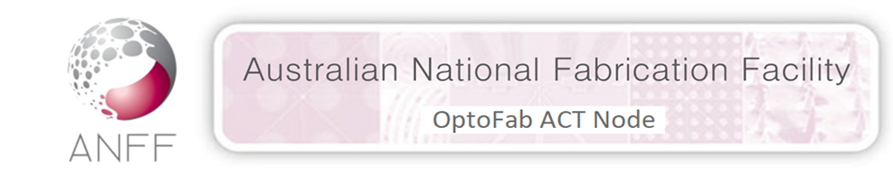
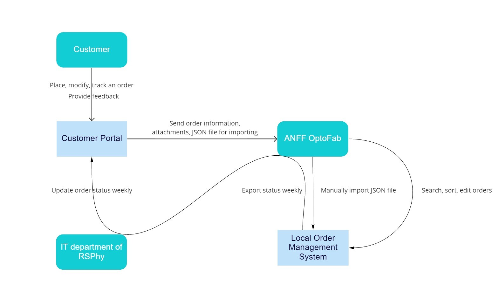
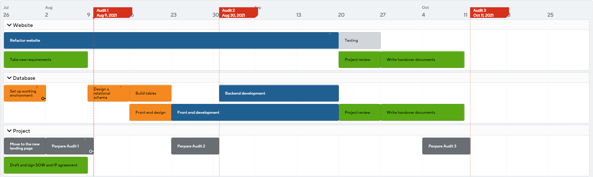

# Landing Page - TechLauncher2021 & ANFF OptoFab

> Our team is helping ANFF OptoFab to streamline the process for placing and managing orders by designing an online order placing web application and a local order management system. 



## Project Overview

| Local Order Management System                                                   | [Customer Portal Web Application](http://tl20212.cecs.anu.edu.au/home.html)                    |
| -------------------------------------------------------------------------------------- | ------------------------------------------------------------------------------ |
| Import orders submitted on the ANFF OptoFab website       | Allow customers to place orders in an OptoFab-staff-friendly way  |
| Store and display client order specifications, links of metrology and operational information    | Allow customers to provide feedback and request for modification      |
| Search and sort the orders and parts by certain attributes                  | Show order status by order number on the web page                    |
| Export a list of statuses for each order. | After order submitting, generate a readable email for both the customer and OptoFab staff, attach a JSON file for later importing |

- Must be easily maintained and modified by untrained non-IT staff
- Must be intuitive for both clients and users
- Must be flexible enough to be modified and reused for future capabilities
- Must comply with ANU IT security requirements
- CSIT and the IT department of RSPhys must be consulted on design and implementation

<a href="#page-title" class="back-to-top">{{ site.data.text[site.locale].back_to_top | default: 'Back to Top' }} &uarr;</a>

## Client

| Name     | **ANFF OptoFab ACT**                                                                                                                                                                           |
| -------- | ---------------------------------------------------------------------------------------------------------------------------------------------------------------------------------------------- |
| Website  | http://optofab-act.org.au                                                                                                                                                                      |
| Contacts | Johannes Eichholz: <johannes.eichholz@anu.edu.au>  Deon Hickey: <Deon.Hickey@anu.edu.au>  Steve Madden: <stephen.madden@anu.edu.au>  Sukanta Debbarma : <debbarma.sukanta@anu.edu.au> |

## Project Mentor/Tutor

Our mentor this semester is **Greg Bek**: <Greg.Bek@anu.edu.au>

## Core Team

:panda_face: **Wo Tian**: Project manager, Spokesperson, Developer  
:beetle: **Tian(Phillip) Wu**: Deputy spokesperson, Developer 
:tiger: **Yaoyi(Grace) Xu**: Developer, Editor, Checker 
:rabbit: **Ruoqian(Raymond) Wu**: Developer, Innovator, Designer 
:tropical_fish: **Ruiqiao(Eva) Jiang**: Developer, Planner, Checker 
:honeybee: **Guoyu(Ashley) Wang**: Developer, Planner, Checker 
:koala: **Hengrui(Henry) Xu**: Developer, Planner, Checker 

## Shadow Team

- Team: Heart Decisions
- Landing Page: https://sites.google.com/view/heart-decision-project/home

<a href="#page-title" class="back-to-top">{{ site.data.text[site.locale].back_to_top | default: 'Back to Top' }} &uarr;</a>

## Communication Plan

| Description                       | Frequency                                              | Channel      | Audience                             |
| --------------------------------- | ------------------------------------------------------ | ------------ | ------------------------------------ |
| Tutorial                          | Wednesday 5:00 - 7:00 PM on Week 2, 4, 5, 7, 9, 11, 12 | Zoom         | All team members and tutor           |
| Audit                             | Wednesday 6:30 - 7:00 PM on Week 3, 6, 10              | Zoom         | All team members, tutor, and clients |
| Client meeting                    | Monday 1:30 - 4:00 PM   Friday 3:00 - 6:00 PM       | In person    | Project manager and clients          |
| Group meeting                     | Monday 8:00 - 8:30 PM   Friday 9:00 - 9:30 PM       | Zoom         | All team members                     |
| Shadow team meeting               | TBD                                                    | Zoom         | Spokespersons from both teams        |
| Updates and Q&A with clients      | As needed                                              | Slack, Email | Project manager and clients          |
| Updates and Q&A with tutor        | As needed                                              | Email        | Spokespersons and tutor              |
| Updates and Q&A with team members | As needed                                              | Wechat       | All team members                     |

## Problematisation analysis using PCM

For detailed analysis, check our [Project Client Map]()

## Stakeholder analysis

- High power, interested people: must fully engage and make the greatest efforts to satisfy.
- High power, less interested people: put enough work in to keep them satisfied, but not so much that they become bored with the update.
- Low power, interested people: keep them adequately informed, communicate to ensure that no major issues are arising. Can often be very helpful with the detail of our project.
- Low power, less interested people: monitor them but do not bore them with excessive communication

## Roadmap

## Signed Documents

1. [IP Agreement](https://drive.google.com/file/d/12rgwSPgemu6QXGw0aGcGvGf38F81438s/view?usp=sharing) to be signed by clients
2. [Statement of Work](https://drive.google.com/file/d/1vpqhioHUuabKZ8ZHjsuap7i5kvkgU_nz/view?usp=sharing) to be signed by clients

## Showcase Videos

### 2021 Semester 1 Showcase



## Useful Links

Here you can find the links to the repositories and tools that our team is using for this project:

> If you don’t have access to any of the following links, please write to [us](mailto:tian.wu@anu.edu.au?cc=wo.tian@anu.edu.au) ”

| Link                                                                                                                          | Description                                                                                          |
| ----------------------------------------------------------------------------------------------------------------------------- | ---------------------------------------------------------------------------------------------------- |
| [OptoFab Customer Portal](http://tl20212.cecs.anu.edu.au/home.html)                                                           | Our main **product** for placing, modifying and tracking an online order.                            |
| [GitHub Pages - landing page](https://optofab.github.io/)                                                                     | Our landing page in 2021 Semester 2.                                                                 |
| [Google Drive for quick collaborations](https://drive.google.com/drive/folders/1M0pZ2kZg80FpKvoFc_t8RjgAF3gNdi9V?usp=sharing) | Our team uses Google Drive to make online polls, document collaborations, etc.                       |
| [GitHub - team coding repo](https://github.com/swingrope/optofab-website)                                                     | Currently we are focusing on front-end development using `React.js`                                  |
| [Slack Channel to collaborate with client](http://comp8715anff.slack.com)                                                     | The Slack channel is used to provide a more user-friendly overview of our project.                   |
| [Miro for prototype design](https://miro.com/app/board/o9J_lPISVWY=)                                                          | The Miro whiteboard is a convenient tool to visualise interface designs quickly and collaboratively. |
| [Mockplus for website design](https://app.mockplus.cn/s/KhYir6nf92Z)                                                          | Our team uses the Mockplus to work on quick and responsive website mockups collaboratively.          |
| [Relational Schema](https://app.creately.com/diagram/F2eCkufCpve/edit)                                                        | We use Creately to draw relational schema for the DBMS we are going to design next semester.         |
